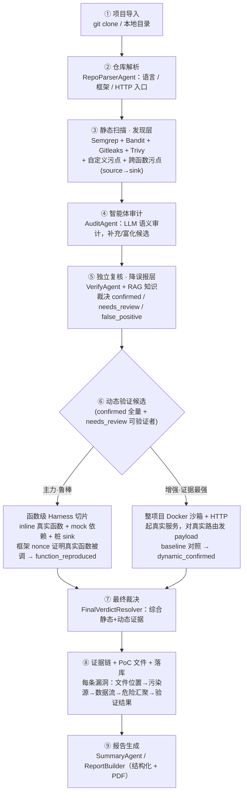
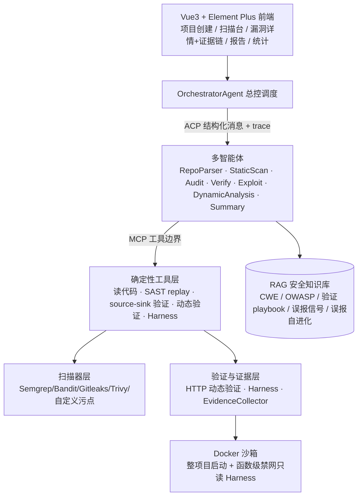

# AuditAgentX

AuditAgentX 是一个面向课程实验、安全研究原型和本地授权靶场的代码安全审计平台。它把传统 SAST 工具、自定义轻量污点分析、LLM 多智能体审计、独立复核、RAG 安全知识库、动态 HTTP 验证、真实源码 Harness、证据链和报告生成串成一条可复现流程。

一句话定位：**静态发现 + 静态复核 + 动态验证 + 有限的运行时异常发现**。它**不是**能自动完整启动任意开源项目的系统，**也不是**面向公网目标的通用 DAST。详见下方「能力边界」。

完整逐目录、逐文件说明见：[`docs/PROJECT_OVERVIEW.md`](docs/PROJECT_OVERVIEW.md)。Docker、Deep 模式、真实靶场和故障诊断见：[`docs/DOCKER_DYNAMIC_TESTING_GUIDE.md`](docs/DOCKER_DYNAMIC_TESTING_GUIDE.md)。

## 系统主流程（一图看懂）

从「一个开源项目」到「可复现的漏洞证据 + 报告」，端到端流程如下（GitHub 直接渲染）：



## 分层架构



## 两个动态验证引擎（核心）

| | **函数级 Harness（主力）** | **HTTP 动态验证（增强）** |
|---|---|---|
| 做什么 | 把漏洞函数抠出来 inline，mock 一切外部依赖、桩危险 sink，喂污点看是否到 sink | 起整个项目（Docker/Compose），对真实路由发攻击 payload，看 oracle 判据 |
| 前提 | 只需禁网只读小沙箱（**不装依赖、不起服务**）——鲁棒 | 需项目能在 Docker 里跑起来——证据最强但脆弱 |
| 结论 | `function_reproduced`（框架 nonce 证明真实函数被调用） | `dynamic_confirmed`（入口级端到端复现） |
| 反自欺 | 每次随机 nonce 插桩，脚本自报字段**一律不采信** | baseline 对照、`blocked ≠ 未复现`、盲注不靠单次长度差硬凑 |

## 核心能力

- 支持本地目录和 Git 仓库扫描。
- 融合 Semgrep、Bandit、Gitleaks、Trivy 和自定义污点规则，`custom` 扫描器始终兜底执行。
- 自定义扫描包含顺序/变量敏感的跨语言轻量污点、Python AST 跨函数污点、Java `javalang` 顺序敏感函数级污点。
- 多 Agent 流程：RepoParser、StaticScan、Audit、Verify、Exploit、DynamicAnalysis、Summary（报告生成与 RAG 修复建议已并入 SummaryAgent，不再有独立 report_agent/poc_agent）。
- ACP 结构化 Agent 通信和 trace。
- MCP 工具边界与 RAG 知识库：CWE、OWASP、验证 playbook、误报信号、修复建议。
- 动态验证有两条真实路径：**整项目 Docker + HTTP 验证（增强能力）** 与 **函数级真实源码 Harness（主要回退路径）**，详见「动态验证与网络边界」。
- Harness 验证区分 `target_confirmed`（框架 nonce 独立证明真实目标函数被调用）和 `mechanism_confirmed`（内置模板证明漏洞机理）。脚本自报的字段一律不采信。
- 前端提供项目创建、扫描工作台、漏洞详情、证据链、动态验证、报告和统计视图。
- 提供 OWASP BenchmarkJava 分类评测脚本。

## 能力边界

- 当前是 MVP/实验原型，不是生产级漏洞扫描服务。
- 能力准确表述为「**静态发现 + 静态复核 + 动态验证 + 有限的运行时异常发现**」。
- **不是**「能自动完整启动任意开源项目」的系统。让真实第三方项目「自动构建并跑起来」是已知难题，不是所有项目都能起；起不来时动态验证会回退到函数级真实源码 Harness，而非声称复现成功。
- **不是**通用外网 DAST。动态验证只允许用于本地靶场、Docker 沙箱或明确授权目标；`target_guard` 默认只放行 `localhost`/`127.0.0.1`/`::1` 等回环地址，需显式设 `allow_external_dynamic_targets=True` 才能打其它目标。
- Docker / Compose 是**增强能力**（能起来时做整项目 + HTTP 验证）；**函数级真实源码 Harness 是主要回退路径**（项目起不来时仍能对真实模块做验证）。
- `examples/vulnerable_projects/safe_sqli_target` 是安全 SQLi 模拟靶场，不执行真实 SQL。
- 模板 Harness 只证明漏洞类型机理（`mechanism_confirmed`），不等价于真实项目可利用复现；只有 `target_confirmed` 才代表真实目标函数被调用。
- `.env` 可能包含密钥，不应提交、公开或写入报告或镜像。

## 动态验证与网络边界

动态验证的真实网络关系必须理解清楚，否则容易得出错误结论：

- **HTTP 动态验证**：`DynamicVerifier` 用 `httpx` 且 `trust_env=False`，即**主动忽略系统代理环境变量**（`HTTP_PROXY`/`HTTPS_PROXY` 等），避免请求被系统代理改写或转发到非预期目标。目标 URL 经 `target_guard` 校验，默认仅回环地址。
- **整项目 Docker 路径（增强）**：Deep 模式尝试用 `docker` / `docker compose` 构建并启动被测项目容器，再对其映射到宿主的端口发 HTTP payload。起不来（缺依赖、需要外部服务、编译失败等）是常态，此时回退到 Harness。
- **函数级真实源码 Harness（主回退）**：把项目源码只读挂载进固定沙箱镜像，`import` 真实模块并调用真实目标函数，用**框架随机 nonce** 独立判定「真实函数是否被调用、攻击 payload 是否到达被 mock 的危险 sink」。脚本自报的 `target_function_called` 一律忽略。沙箱在 run 时叠加 `network=none`、`read_only`、`cap_drop=ALL`、`no-new-privileges`、pids/mem/cpu/timeout 限制，不挂 docker socket、不继承宿主代理。
- **特别强调：Docker 容器里的 `127.0.0.1` 不是宿主机的 `127.0.0.1`。** 容器内的回环指向容器自身；要从宿主访问容器服务，靠的是 Compose/`-p` 的**端口映射**（如 `127.0.0.1:8080:8080`）打到宿主回环；容器之间互访靠 Compose 服务名和自定义网络，而不是 `localhost`。把宿主上跑的靶场地址直接塞进容器、或反过来，都会「连不上」。

## 快速启动

后端：

```powershell
python -m venv .venv
.\.venv\Scripts\Activate.ps1
pip install -r requirements.txt
uvicorn backend.main:app --reload --host 127.0.0.1 --port 8000
```

前端：

```powershell
cd frontend
npm install
npm run dev
```

安全 SQLi 模拟靶场：

```powershell
docker compose up safe-sqli-target --build
```

默认靶场地址：`http://127.0.0.1:8080`。

## 容器化部署（docker-compose）

平台自身可用根目录 `docker-compose.yml` 编排为 `backend`（FastAPI）+ `frontend` 两个服务：

```powershell
# 构建并启动平台（后端 + 前端）
docker compose up --build backend frontend
```

- 后端默认监听容器内 `8000`，映射到宿主 `127.0.0.1:8000`；设置 `.env` 的 `APP_PORT` 后，Uvicorn、容器映射和前端代理会同步使用新端口。前端固定映射到宿主 `127.0.0.1:5173`。
- 运行数据和正式报告统一写入 `data/`（报告位于 `data/reports/`），通过目录挂载持久化，**不打进镜像**（见 `.dockerignore`）。顶层 `reports/` 仅是旧 benchmark 产物目录。
- 业务镜像**默认不挂宿主 docker socket、不继承宿主代理/敏感环境变量**。
- 需要 Deep 模式的「整项目容器动态执行」时，才用被注释掉的 `project-executor` profile 显式启用挂载 docker socket——这会把宿主 Docker 守护进程暴露给后端容器，**等同于宿主 root 权限**，只应在受控环境开启。详见 [`docs/DOCKER_DYNAMIC_TESTING_GUIDE.md`](docs/DOCKER_DYNAMIC_TESTING_GUIDE.md)。

固定 Harness 沙箱镜像（供函数级真实源码验证 `import` 常见框架）由 `docker/harness/Dockerfile` 构建，构建后把其镜像标签写入 `harness_sandbox_image` 即可启用；留空则退回 `python:3.11-slim`（无第三方依赖的函数仍可跑）。

## 常用命令

| 命令 | 说明 |
|---|---|
| `pytest` | 运行后端测试 |
| `cd frontend; npm run build` | 前端类型检查和生产构建 |
| `python scripts/run_owasp_benchmark.py` | 运行 OWASP BenchmarkJava 分类评测，需本地放置数据集 |
| `docker compose up safe-sqli-target --build` | 启动安全 SQLi 模拟靶场 |
| `docker compose up --build backend frontend` | Docker 方式启动平台（后端 + 前端） |

## 目录概览

| 目录 | 说明 |
|---|---|
| `backend/` | FastAPI 后端、多 Agent、扫描器、RAG、MCP、ACP、动态验证和报告生成 |
| `frontend/` | Vue 3 + Element Plus 前端 |
| `rules/` | Semgrep/YARA/custom 规则目录 |
| `scripts/` | 批量扫描、知识库生成和 Benchmark 评测脚本 |
| `examples/` | 演示漏洞项目和安全模拟靶场 |
| `tests/` | 后端单元测试、集成测试、ACP/RAG/Harness/动态验证测试 |
| `data/` | 本地运行数据、扫描缓存、报告和沙箱目录（不进镜像、不进默认备份） |
| `docker/` | 固定 Harness 沙箱镜像（`docker/harness/Dockerfile`） |
| `docs/` | `PROJECT_OVERVIEW.md`（集中式项目说明）与 `DOCKER_DYNAMIC_TESTING_GUIDE.md`（Docker/动态验证指南） |

## Benchmark 现状

在 OWASP BenchmarkJava 早期初步评测中，AuditAgentX 对 SQLi、命令注入、路径遍历等注入类已有一定检测能力，粗略召回约 39%。当前代码已加入 Java 函数级污点、弱算法和弱随机增强；最新结果应以 `python scripts/run_owasp_benchmark.py` 在本地 BenchmarkJava 数据集上的实际输出为准。后续仍应继续增强 XSS、弱加密、弱随机、Trust Boundary 等 Java Web 类别，并用分类指标持续回归。
